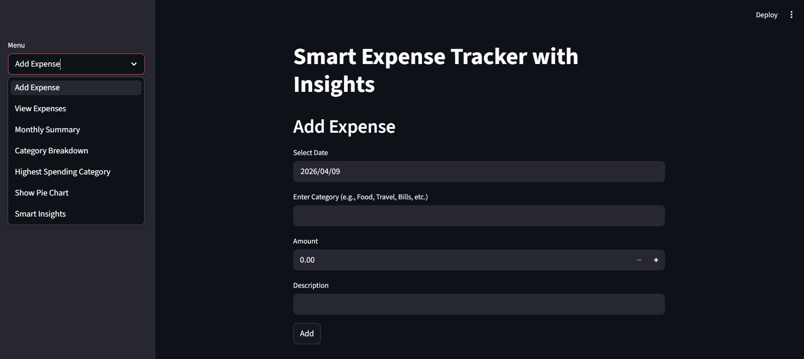
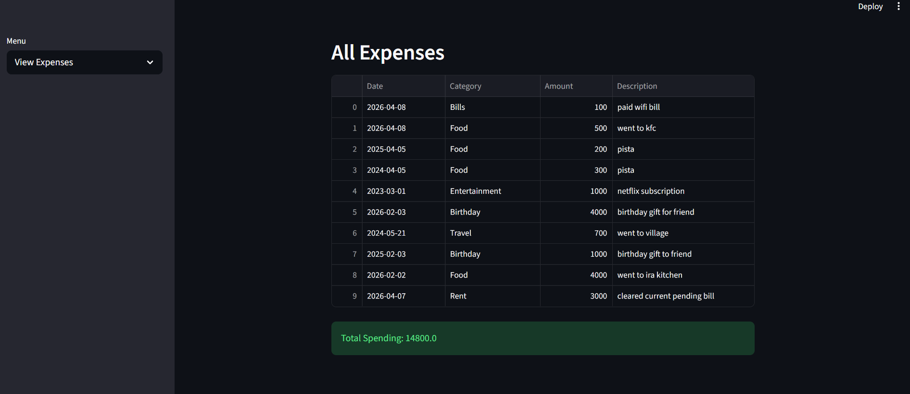
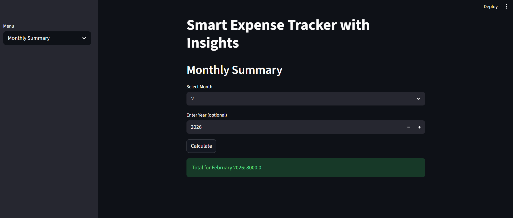
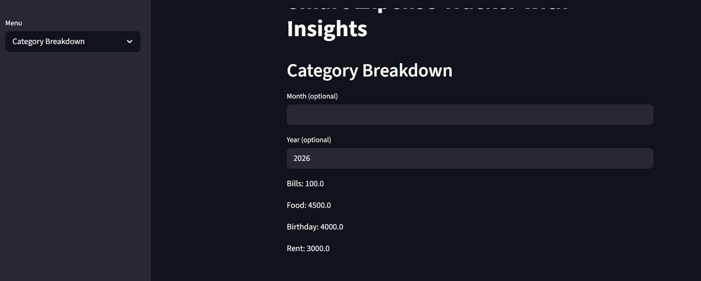
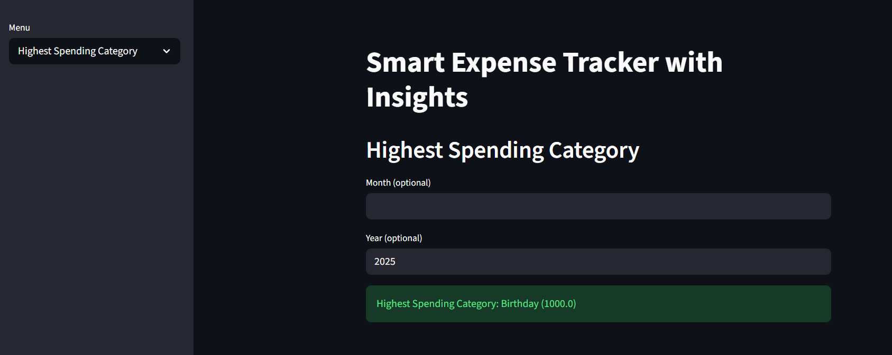
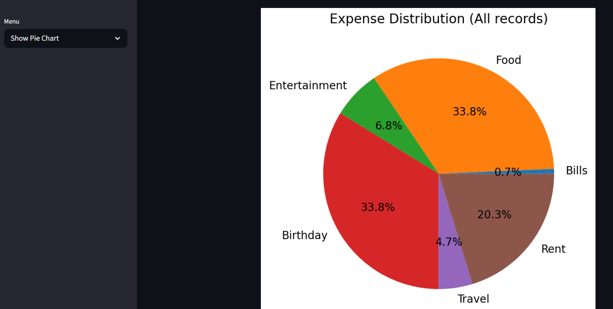
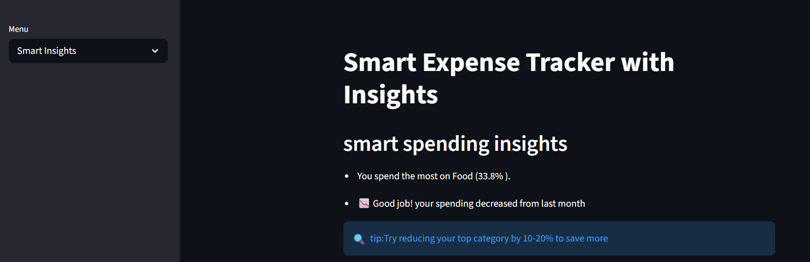

# Smart-Expense-Tracker-with-Insights-virtusa-assignment-python

## 1. Project Overview
This project is a Smart Expense Tracker developed using Python. The main purpose of this application is to help users record their daily expenses, organize them into categories, and analyze their spending patterns.

The system supports both a Command Line Interface (CLI) and a Streamlit-based dashboard, making it easy to interact with the data and visualize insights.

## 2. Objectives
- record daily expenses with date, category, amount, and description  
- categorize expenses such as Food, Travel, Bills, etc.  
- generate monthly summaries  
- provide category-wise spending analysis  
- identify highest spending category  
- provide basic suggestions to reduce unnecessary spending

## 3. Key Features
### 3.1 Expense Recording
users can add expenses with proper validation. Each expense includes:
- Date  
- Category  
- Amount  
- Description

all the data is stored in csv file

### 3.2 Data Storage and Handling
The system uses CSV file handling for storing and retrieving data.  
Each row represents one expense entry, and data is converted into objects for processing part.

### 3.3 Monthly Summary with Flexible Filtering
The monthly summary feature is designed with proper filtering logic:
- Month input is mandatory  
- Year input is optional  

**Behavior:**
- if both month and year are provided → summary is calculated for that specific month and year  
- if only month is provided → summary includes that month across all years  
- if year is not provided → system aggregates data from multiple years

### 3.4 Category-wise Breakdown
the application groups expenses by category and calculates total spending for each category.  

**Filtering logic:**
- supports optional month and year filtering  
- if no filters are provided → analysis is done on the entire dataset  
- if filters are provided → only matching records are considered

### 3.5 Highest Spending Category
The system identifies the category with the highest total spending.  
- uses aggregated category data  
- supports filtering by month and year  
- works for both full dataset and filtered data

### 3.6 Data Visualization (Pie Chart)
A pie chart is generated to visually represent category-wise spending.  
- uses matplotlib for visualization  
- chart title dynamically changes based on filters:  
  - all data  
  - specific month  
  - specific month and year

### 3.7 Smart Insights
The system provides basic insights based on expense data:
- identifies highest spending category  
- calculates percentage contribution  
- detects if spending is concentrated in few categories  
- compares recent monthly spending trends  

This feature helps users identify areas where they can reduce spending.

### 3.8 Streamlit Dashboard
A user-friendly interface is implemented using Streamlit.  

**Features:**
- sidebar navigation  
- interactive inputs  
- table-based expense display  
- dynamic charts  
- insight display

## 4. Tools and Technologies Used
- Python  
- CSV module  
- Datetime module  
- Matplotlib  
- Streamlit  
- Pandas 

## 5. Project Structure
```
smart_expense_tracke_with_insights/
│
├── main.py
├── app.py
├── expense.py
├── storage.py
├── analysis.py
├── utils.py
├── data.csv
└── README.md
```

## 6. How to run this Project
### 6.1 Run CLI Version
```bash
python main.py
```
### 6.2 Run streamlit version
```bash
streamlit run app.py
```

## 7. Screenshots

### Dashboard View


### view expenses


### Monthly summary


### category breakdown


### highest spending category


### show pie chart


### smart insights


## 8. Overall logic (In simple way)

- expenses are stored in CSV and converted into objects  
- category totals are calculated using dictionary-based aggregation  
- month and year are extracted from date for filtering  
- filtering is applied consistently across all features:
  - monthly summary  
  - category breakdown  
  - highest spending category  
  - pie chart  
- Optional filtering ensures flexibility without losing accuracy  


